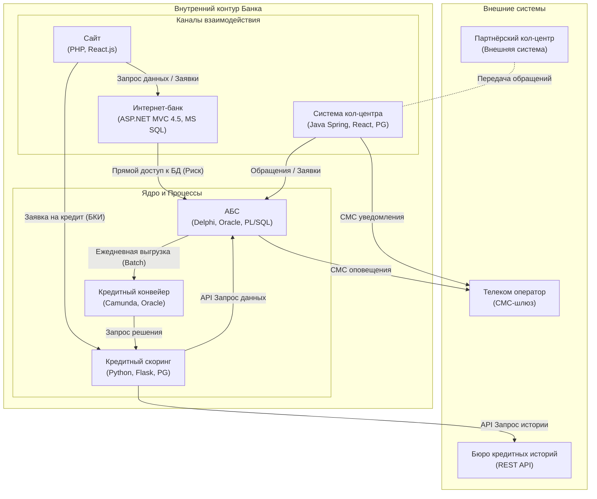

# Задача 1

## 1. Карта текущего IT-ландшафта

Для карты ландшафта табличное представление в Markdown будет объективно удобнее для восприятия, чем диаграмма Mermaid, так как позволяет четко сопоставить организационные единицы и бизнес-возможности.

| Организационная единица | Продажи в сети отделений | Продажи через кол-центр | Digital-оповещения клиентов | Обслуживание депозитных процессов | Обслуживание кредитных процессов | Управление договорами |
| :--- | :---: | :---: | :---: | :---: | :---: | :---: |
| **Управление обслуживанием в сети отделений** (Фронт-офис, 500 чел.) | ✓ АБС (Delphi) | — | — | ✓ АБС, Excel (ручной расчет) | ✓ АБС, Кредитный конвейер | ✓ АБС (загрузка документов) |
| **Управление IT** (40 чел.) | — | — | СМС-шлюз | Интернет-банк (ASP.NET) | Конвейер (Camunda), Скоринг (Python) | АБС (Oracle) |
| **Управление обслуживанием депозитных продуктов** (Бэк-офис, 50 чел.) | — | Обработка заявок из КЦ | — | АБС, Excel (ставки) | — | АБС |
| **Управление обслуживанием кредитных продуктов** (Бэк-офис, 50 чел.) | — | — | — | — | Кредитный конвейер, Скоринг | АБС |
| **Кол-центр банка** (200 операторов + 5 подрядчик) | — | Система КЦ (Java/React) | СМС-шлюз | Система КЦ → АБС | — | — |
| **Партнёрский кол-центр** (100 чел.) | — | Внешняя система | — | — | — | — |
| **Команда цифровой трансформации** (10 чел.) | — | — | Сайт (PHP/React) | Интернет-банк (MVP) | Интернет-банк, Сайт | — |

## 2. Схема интеграции приложений

* InternetBank ↔ ABS: Обозначает прямую интеграцию на уровне базы данных. Это нарушает принцип инкапсуляции и создает зависимости между схемами БД.
* АБС → Конвейер: Передача данных раз в сутки является узким местом для цели "решение за 1 день".

## 3. Описание кредитного процесса

### Текущий процесс (Credit Process As-Is)

1. Инициация: Клиент подает заявку в отделении → Менеджер вводит данные в АБС.
2. Передача: Заявка накапливается в АБС → Раз в сутки пакетно передается в Кредитный конвейер (интеграция по БД).
3. Обработка: Менеджер кредитного отдела берет заявку в Конвейере.
4. Скоринг: Конвейер инициирует запрос в Систему скоринга.
    * Скоринг запрашивает данные в АБС (через БД/API).
    * Скоринг запрашивает данные в БКИ (REST API, онлайн).
    * Проблема: Данные о платежах внутри АБС могут передаваться в скоринг с задержкой (раз в сутки).
5. Решение: Менеджер принимает решение в Конвейере.
6. Финализация: Статус «Одобрено» → Раз в сутки передается обратно в АБС → Зачисление средств.

### Выявленные ограничения для целевой модели

* Время цикла: Из-за пакетной передачи (раз в сутки) минимальное время обработки превышает 24 часа, что противоречит цели «решение в течение одного дня» при подаче онлайн.
* Онлайн-каналы: Отсутствие прямой интеграции Сайта и Интернет-банка с Кредитным конвейером и Скорингом не позволяет реализовать предодобренные предложения.
* Безопасность: Прямой доступ Интернет-банка к БД АБС требует пересмотра при открытии доступа из внешних сетей (если Интернет-банк выведен в DMZ)
