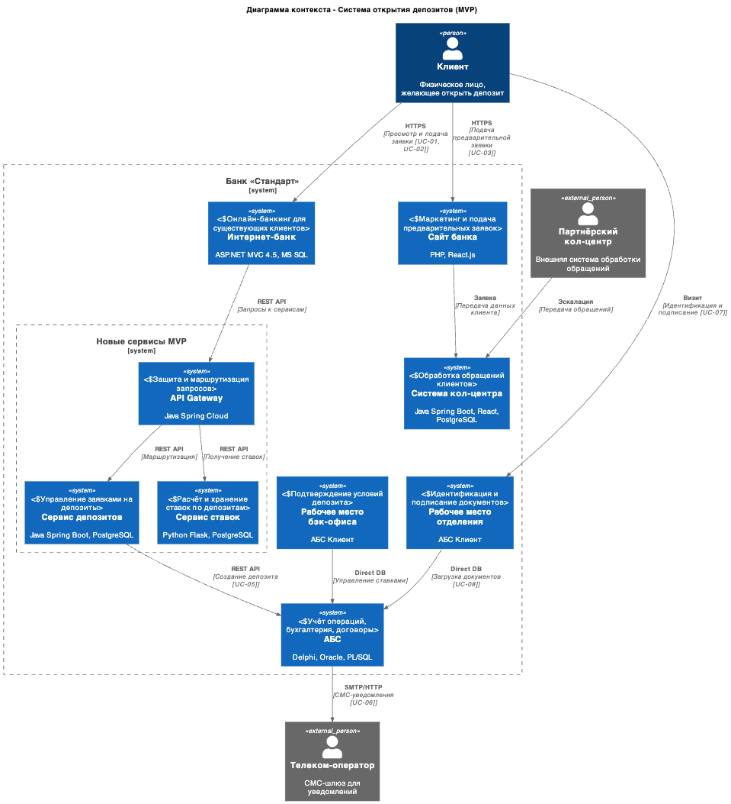
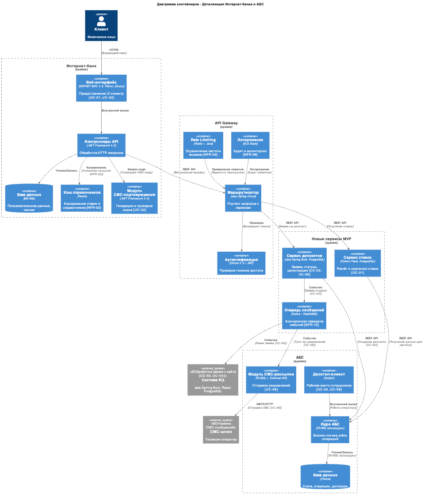

### **Название задачи: Архитектура MVP онлайн-открытия депозитов в банке "Стандарт"** 
### **Автор:**
### **Дата: 2026-03-15**
### **Функциональные требования**

| № | Действующие лица или системы | Use Case | Описание |
| :-: | :- | :- | :- |
| UC-01 | Клиент (Интернет-банк) | Просмотр доступных депозитов | Клиент авторизуется в интернет-банке и видит список депозитов с актуальными и персонализированными ставками |
| UC-02 | Клиент (Интернет-банк) | Подача заявки на депозит | Клиент выбирает счёт, сумму, срок депозита и подтверждает заявку СМС-кодом |
| UC-03 | Клиент (Сайт) | Подача предварительной заявки на депозит | Новый клиент оставляет ФИО и телефон для последующего звонка менеджера КЦ |
| UC-04 | Менеджер КЦ | Обработка заявки с сайта | Менеджер получает заявку из системы КЦ, связывается с клиентом, может предложить особые условия |
| UC-05 | Менеджер бэк-офиса | Подтверждение условий депозита | Сотрудник проверяет заявку, утверждает ставку в АБС, инициирует открытие продукта |
| UC-06 | Система | Отправка СМС-уведомлений | Клиент получает СМС о подтверждении ставки и об открытии депозита |
| UC-07 | Клиент (Отделение) | Идентификация и подписание документов | Новый клиент посещает отделение для идентификации и подписания договора |
| UC-08 | Менеджер отделения | Завершение открытия депозита | Сотрудник фронт-офиса загружает подписанные документы в АБС, активирует депозит |

### **Нефункциональные требования**

| № | Требование |
| :-: | :- |
| NFR-01 | Доступность сервисов 99,9% (SLA), работа 24/7 |
| NFR-02 | Время отклика интерфейса < 200 мс для локальных операций |
| NFR-03 | Запрет прямой записи в БД АБС из новых каналов (защита перегруженной БД) |
| NFR-04 | Шифрование трафика (TLS 1.2+) для передачи чувствительных данных |
| NFR-05 | Горизонтальное масштабирование новых сервисов (АБС — только вертикально) |
| NFR-06 | Использование существующего стека банка (.NET, Java, Python, Oracle, MS SQL, PostgreSQL) |
| NFR-07 | Избегание доработок ядра интернет-банка со стороны подрядчика |
| NFR-08 | Логирование и мониторинг всех новых компонентов для соблюдения SLA |
| NFR-09 | Единая дизайн-система банка во всех каналах (сайт, интернет-банк, отделение) |
| NFR-10 | Гарантия доставки транзакционных СМС-уведомлений |

### **Решение**

#### Диаграмма контекста C1

#### Диаграмма контейнеров C2 — Детализация Интернет-банка и АБС

#### Описание основных компонентов и интеграций

| Компонент | Технология | Назначение | Ответственная команда |
| :--- | :--- | :--- | :--- |
| **Интернет-банк (UI)** | ASP.NET MVC 4.5, Razor | Предоставление интерфейса клиенту для просмотра и подачи заявок | IT (подрядчик + внутренняя команда) |
| **Сервис депозитов** | Java Spring Boot, PostgreSQL | Хранение заявок, управление статусами, оркестрация процесса | Команда цифровой трансформации |
| **Сервис ставок** | Python Flask, PostgreSQL | Централизованное хранение и расчёт ставок (замена Excel) | Управление IT + Депозитный бэк-офис |
| **API Gateway** | Java Spring Cloud / Kong | Защита АБС от прямых вызовов, rate limiting, аутентификация | Управление IT |
| **Очередь сообщений** | Kafka (перспектива) / RabbitMQ (MVP) | Асинхронная передача событий между системами | Управление IT |
| **АБС** | Delphi, Oracle, PL/SQL | Учёт операций, хранение договоров, бухгалтерия | Команда АБС (20 чел.) |
| **Система КЦ** | Java Spring Boot, React, PostgreSQL | Обработка обращений, скрипты звонков | Подрядчик КЦ + IT |

#### Логика принятия архитектурных решений

| Решение | Обоснование |
| :--- | :--- |
| **Выделенные сервисы вместо прямой интеграции с АБС** | База данных АБС перегружена (NFR-03). Прямой доступ из интернет-банка создаёт риск отказа основной банковской системы. API Gateway изолирует АБС. |
| **Сервис ставок как отдельный компонент** | Текущее хранение ставок в Excel — критический риск ошибок и отсутствия автоматизации (F-07). Единый источник истины для всех каналов. |
| **Асинхронная обработка через очередь** | Позволяет decouple каналы продаж от бэк-офиса, обеспечивает гарантированную доставку заявок и пиковую нагрузку без потерь (P-02, S-03). |
| **Кэширование справочников в Redis** | Решает проблему загрузки данных >1 секунды (U-01, P-01), снижает нагрузку на АБС при частых чтениях. |
| **Использование Java Spring Boot для новых сервисов** | В команде АБС есть специалисты с опытом Java (task.md). Снижает порог входа и позволяет использовать внутреннюю экспертизу (S-01). |
| **Минимальные доработки интернет-банка** | Ядро платформы принадлежит подрядчику, обновления дороги и долги (NFR-07). Новая логика выносится в отдельные сервисы. |

### **Альтернативы**

| Альтернатива | Описание | Почему не выбрана |
| :--- | :--- | :--- |
| **Прямая интеграция Интернет-банк ↔ АБС (как сейчас)** | Сохранение текущей схемы с прямым доступом к БД АБС | Нарушает NFR-03 (защита перегруженной БД). Блокирует масштабирование. Высокий риск отказа основной системы. |
| **Полная миграция интернет-банка на микросервисы** | Перевод всей платформы интернет-банка на современную архитектуру | Не входит в scope MVP. Требует значительных инвестиций и времени. Текущая платформа несовместима с Kafka (task.md). |
| **Хранение ставок в АБС (без отдельного сервиса)** | Реализация функционала управления ставками внутри АБС | Требуется доработка ядра АБС (Delphi/PL-SQL), что увеличивает зависимость от внутренней команды АБС. Меньшая гибкость для изменений. |
| **Синхронная интеграция всех систем** | Все вызовы между системами происходят в реальном времени | Нагружает систему скоринга и АБС в пиковые часы (P-04). Нет буфера при сбоях. |

**Недостатки, ограничения, риски**

| Категория | Описание | Митигация |
| :--- | :--- | :--- |
| **Технический долг** | Интернет-банк остаётся на устаревшей платформе (.NET Framework 4.5), несовместимой с Kafka | План миграции на .NET Core/.NET 6+ в следующей фазе. Для MVP использовать адаптер или RabbitMQ. |
| **Зависимость от подрядчика** | Доработки ядра интернет-банка требуют участия подрядчика (сроки, стоимость) | Минимизировать изменения в ядре. Новую логику реализовывать в отдельных сервисах (Sidecar pattern). |
| **Сложность интеграции** | Множество точек интеграции (5+ систем) увеличивает риск ошибок при передаче данных | Внедрить сквозное логирование (Correlation ID), контрактное тестирование (Pact), мониторинг (APM). |
| **Производительность АБС** | Даже с API Gateway АБС остаётся узким местом (вертикальное масштабирование) | Кэширование читаемых данных, асинхронная запись, ограничение частоты вызовов (Rate Limiting). |
| **Безопасность** | Новые сервисы расширяют поверхность атаки | TLS 1.2+, взаимная аутентификация сервисов (mTLS), сегментация сети, регулярный security audit. |
| **Операционные риски** | Команда должна поддерживать 3 новых сервиса + существующие системы | Автоматизация деплоя (CI/CD), документация (Runbooks), обучение команды, мониторинг (Alerting). |
| **Неполная автоматизация (MVP)** | Бэк-офис всё ещё участвует в процессе (ручное подтверждение) | Это сознательное ограничение MVP. План автоматизации — фаза 2 (цель: год). |
| **Идентификация новых клиентов** | Требуется визит в отделение (требование регулятора) | Нельзя полностью исключить офлайн-этап без биометрии/ЕСИА. Улучшать процесс записи в отделение. |
| **Консистентность данных** | Распределённая система требует обеспечения согласованности (депозит, счёт, уведомление) | Паттерн Saga для транзакций, компенсирующие транзакции при откатах. |
| **Резервирование** | Интернет-банк работает в одном ЦОД (task.md) | Реализовать автоматический failover на резервный ЦОД. Требования 99,9% пока невыполнимы без модернизации (NFR-01). |
