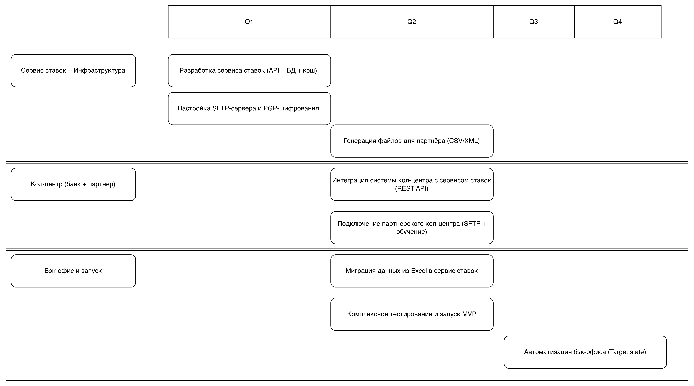

### **Обеспечение доступа кол-центра и партнёрского кол-центра к актуальным ставкам по депозитам** 
### **Автор:**
### **Дата: 2026-03-15**
### **Функциональные требования**

| № | Действующие лица или системы | Use Case | Описание |
| :-: | :- | :- | :- |
| UC-01 | Оператор кол-центра банка | Просмотр актуальных ставок по депозитам | Оператор открывает систему кол-центра и видит текущие ставки для консультирования клиентов |
| UC-02 | Оператор партнёрского кол-центра | Получение файла со ставками | Партнёр получает актуальный файл со ставками через SFTP для офлайн-консультирования |
| UC-03 | Система банка | Генерация файла ставок для партнёра | Автоматическая выгрузка актуальных ставок в формате CSV/XML на SFTP-сервер |
| UC-04 | Менеджер бэк-офиса | Обновление ставок в системе | Сотрудник вносит изменения в ставки через сервис ставок (замена Excel) |
| UC-05 | Система | Уведомление об изменении ставок | При изменении ставок система автоматически инициирует выгрузку файла для партнёра |
| UC-06 | Клиент | Получение консультации по ставкам | Клиент звонит в кол-центр и получает актуальную информацию по телефону |

### **Нефункциональные требования**

| № | Требование |
| :-: | :- |
| NFR-01 | Актуальность данных о ставках не более 15 минут для кол-центра банка |
| NFR-02 | Актуальность данных для партнёрского кол-центра не более 1 часа |
| NFR-03 | Доступность сервиса ставок 99,9% в рабочие часы (09:00-20:00 МСК) |
| NFR-04 | Шифрование файла со ставками при передаче по SFTP (PGP/GPG) |
| NFR-05 | Аудит всех изменений ставок (кто, когда, какие изменения внёс) |
| NFR-06 | Время генерации файла для партнёра не более 5 минут |
| NFR-07 | Совместимость формата файла с внешней системой партнёра (CSV/XML) |
| NFR-08 | Минимальные доработки системы кол-центра подрядчика |
| NFR-09 | Использование существующего стека технологий банка (Java, Python, PostgreSQL) |
| NFR-10 | Масштабируемость решения для подключения дополнительных партнёров в будущем |

### **Решение**

#### Диаграмма контекста C1

#### Диаграмма контейнеров C2 

#### Логика принятия архитектурных решений

| Решение | Обоснование |
| :--- | :--- |
| **REST API для внутреннего кол-центра** | Система кол-центра уже на Java Spring Boot, легко интегрируется с REST. Обеспечивает актуальность <15 мин (NFR-01). |
| **SFTP + PGP для партнёра** | Единственный доступный вариант по требованию партнёра. PGP обеспечивает безопасность передачи чувствительных данных (NFR-04). |
| **Кэширование ставок в Redis** | Снижает нагрузку на БД сервиса ставок при частых запросах от 200 операторов кол-центра. |
| **Автоматическая выгрузка по событию** | При изменении ставок файл генерируется автоматически, а не по расписанию —确保 актуальность для партнёра (NFR-02). |
| **Аудит всех изменений ставок** | Требование безопасности и комплаенса для финансовых данных. Позволяет отслеживать кто и когда изменил ставку. |
| **Выделенный сервис ставок** | Убирает зависимость от Excel-файлов, создаёт единый источник истины для всех каналов (сайт, ИБ, кол-центр, партнёр). |

### **Альтернативы**

| Альтернатива | Описание | Почему не выбрана |
| :--- | :--- | :--- |
| **Прямой доступ кол-центра к БД сервиса ставок** | Дать системе кол-центра прямой доступ к PostgreSQL | Нарушает принцип инкапсуляции, создаёт tight coupling. Нет аудита запросов. |
| **Ручная выгрузка файла для партнёра** | Менеджер вручную генерирует и отправляет файл через email/SFTP | Высокий риск человеческой ошибки, задержки, нет аудита. Противоречит цели автоматизации. |
| **SOAP API для партнёра** | Предложить партнёру веб-сервис вместо файла | Партнёр явно указал невозможность API-вызовов. Техническое ограничение внешней системы. |
| **Хранение ставок в АБС** | Реализовать управление ставками внутри АБС (Oracle/PL-SQL) | Требует доработки ядра АБС, увеличивает зависимость от команды АБС. Меньшая гибкость. |
| **Email-рассылка файлов партнёру** | Отправлять файл по защищённому email | Менее надёжно чем SFTP, сложнее автоматизировать получение на стороне партнёра. |
| **Общий кэш для всех каналов** | Один Redis для ИБ, сайта и кол-центра | Нарушает принцип изоляции. Сбой кэша затронет все каналы одновременно. |

**Недостатки, ограничения, риски**

| Категория | Описание | Митигация |
| :--- | :--- | :--- |
| **Зависимость от партнёра** | Партнёр может загружать файл с задержкой, что приведёт к неактуальным данным у операторов | SLA с партнёром на время загрузки файла. Мониторинг времени последней выгрузки. |
| **Безопасность SFTP** | Ключи PGP требуют безопасного хранения и ротации | HSM или Vault для хранения ключей. Автоматическая ротация каждые 90 дней. |
| **Нагрузка на сервис ставок** | 200 операторов + интернет-банк + сайт = потенциально высокая нагрузка | Кэширование в Redis, горизонтальное масштабирование сервиса ставок, rate limiting. |
| **Консистентность данных** | Риск рассинхронизации между кэшем и БД при обновлении ставок | TTL кэша не более 5 минут. Инвалидация кэша при каждом изменении ставок. |
| **Формат файла** | Партнёр может изменить требования к формату файла без предупреждения | Контрактное тестирование. Версионирование формата файла (rates_v1.csv, rates_v2.csv). |
| **Отказ SFTP-сервера** | При сбое SFTP партнёр не получит актуальные ставки | Резервный SFTP-сервер. Уведомление администраторов при неудачной выгрузке. |
| **Доработки системы кол-центра** | Подрядчик может затянуть интеграцию REST API | Минимальные изменения в UI кол-центра. API-клиент реализуется внутренней командой банка. |
| **Комплаенс** | Передача данных внешней организации требует согласования безопасности | Юридическое соглашение NDA. Шифрование PGP обязательно. Аудит всех передач. |
| **Технический долг** | Временное решение с файлами для партнёра может закрепиться | План перехода на API при модернизации системы партнёра (фаза 2, год). |
| **Масштабирование** | При подключении новых партнёров потребуется индивидуальная настройка | Конфигурируемые профили партнёров (формат, расписание, ключи шифрования). |

## Список крупных задач для планирования

### Сервис ставок + Инфраструктура

| Задача | Квартал | Приоритет |
| :- | :-: | :-: |
| Разработка сервиса ставок (API + БД + кэш) | Q1 | Критический |
| Настройка SFTP-сервера и PGP-шифрования | Q1 | Критический |
| Генерация файлов для партнёра (CSV/XML) | Q2 | Критический |

### Кол-центр (банк + партнёр)

| Задача | Квартал | Приоритет |
| :- | :-: | :-: |
| Интеграция системы кол-центра с сервисом ставок (REST API) | Q2 | Критический |
| Подключение партнёрского кол-центра (SFTP + обучение) | Q2 | Критический |

### Бэк-офис и запуск

| Задача | Квартал | Приоритет |
| :- | :-: | :-: |
| Миграция данных из Excel в сервис ставок | Q2 | Критический |
| Комплексное тестирование и запуск MVP | Q2 | Критический |
| Автоматизация бэк-офиса (Target state) | Q3-Q4 | Высокий |

### Дорожная карта

