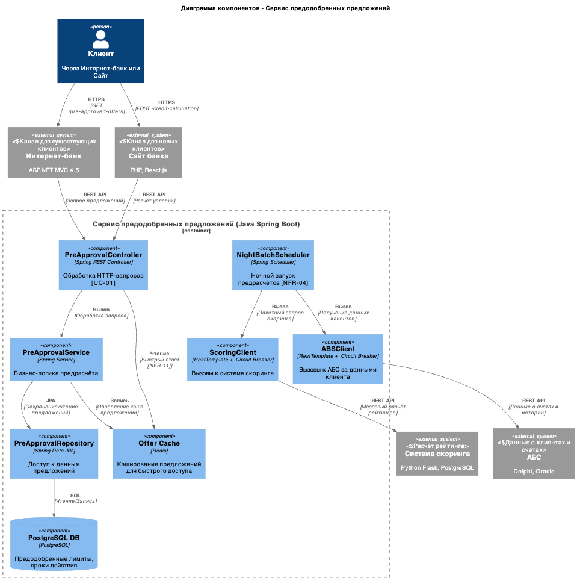
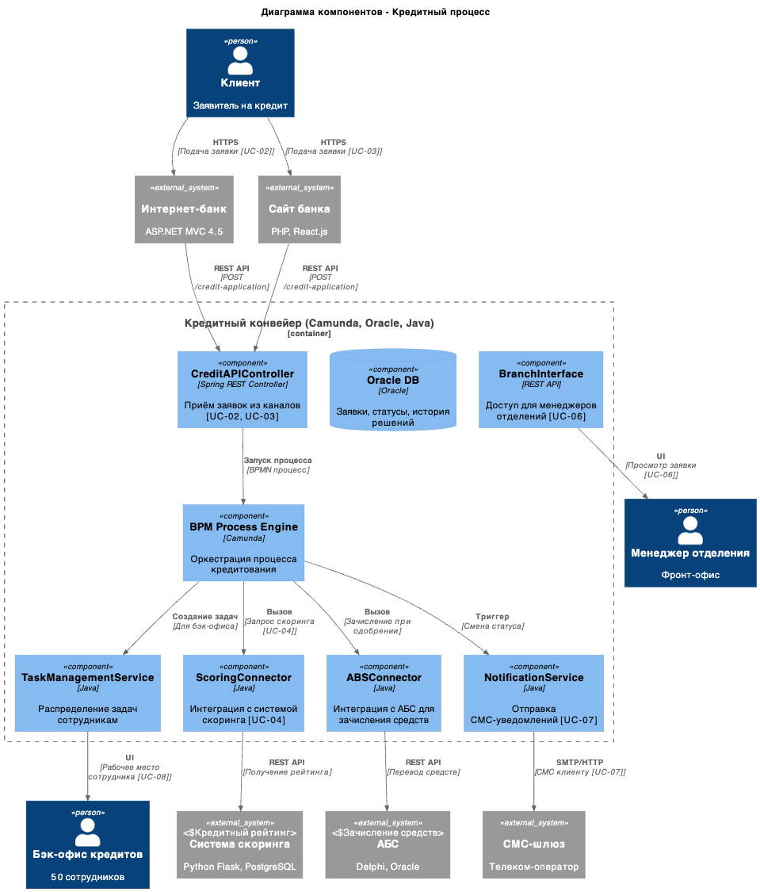

### **Цифровизация кредитного процесса с онлайн-заявками и предодобренными предложениями** 
### **Автор:**
### **Дата: 2026-03-15**
### **Функциональные требования**

| № | Действующие лица или системы | Use Case | Описание |
| :-: | :- | :- | :- |
| UC-01 | Клиент (Интернет-банк) | Просмотр предодобренных кредитных предложений | Авторизованный клиент видит персонализированные условия кредита на основе предварительного скоринга |
| UC-02 | Клиент (Интернет-банк) | Подача заявки на кредит онлайн | Клиент заполняет заявку, указывает счёт зачисления, подтверждает СМС-кодом |
| UC-03 | Клиент (Сайт) | Подача предварительной заявки на кредит | Новый клиент оставляет ФИО, телефон, паспортные данные для получения решения |
| UC-04 | Система | Автоматический скоринг заявки | Система запрашивает данные из БКИ и АБС, рассчитывает рейтинг клиента |
| UC-05 | Система | Выдача решения по кредиту в течение 1 дня | Клиент получает одобрение/отказ в течение рабочего дня |
| UC-06 | Менеджер отделения | Продолжение работы с онлайн-заявкой | Менеджер видит существующую заявку клиента, одобренную онлайн |
| UC-07 | Система | СМС-уведомление о статусе заявки | Клиент получает уведомления об изменении статуса заявки |
| UC-08 | Бэк-офис кредитов | Обработка упрощённых заявок | Сотрудники обрабатывают предодобренные заявки по ускоренной процедуре |

### **Нефункциональные требования**

| № | Требование |
| :-: | :- |
| NFR-01 | Решение по кредиту в течение 1 рабочего дня (для онлайн-заявок) |
| NFR-02 | Доступность сервиса подачи заявок 99,9% в рабочие часы |
| NFR-03 | Защита персональных данных при передаче (TLS 1.2+, шифрование ПДн) |
| NFR-04 | Система скоринга не должна нагружаться дополнительными предрасчётами в пиковые часы |
| NFR-05 | Горизонтальное масштабирование новых сервисов (Кредитный конвейер и Скоринг поддерживают) |
| NFR-06 | Избегание прямой интеграции Интернет-банка с БД АБС для новых процессов |
| NFR-07 | Использование существующего стека банка (Java, Python, .NET, Oracle, PostgreSQL, MS SQL) |
| NFR-08 | Логирование и аудит всех решений по кредитам (комплаенс) |
| NFR-09 | Единая дизайн-система банка во всех каналах (сайт, интернет-банк, отделение) |
| NFR-10 | Гарантия доставки СМС-уведомлений о статусе заявки |
| NFR-11 | Время отклика интерфейса < 200 мс для локальных операций |
| NFR-12 | Поддержка 24/7 для критических компонентов (Конвейер, Скоринг) |

### **Решение**

#### Диаграмма контекста C1

#### Диаграмма контейнеров C3 - Сервис предодобренных предложений

#### Диаграмма контейнеров C3 - Кредитный процесс

#### Логика принятия архитектурных решений

| Решение | Обоснование |
| :--- | :--- |
| **Выделенный сервис предодобренных предложений** | Позволяет выполнять предрасчёт скоринга асинхронно (ночью), не нагружая систему скоринга в рабочие часы (NFR-04). Кэширование обеспечивает быстрый отклик < 200 мс (NFR-11). |
| **REST API между Интернет-банком и Кредитным конвейером** | Заменяет текущую batch-интеграцию по БД (раз в сутки). Позволяет обрабатывать заявки онлайн в реальном времени для выполнения NFR-01 (решение за 1 день). |
| **Асинхронный ночной предрасчёт для существующих клиентов** | Использует данные АБС о текущих клиентах для формирования предодобренных предложений без нагрузки на скоринг в пик. |
| **Circuit Breaker для вызовов к АБС и Скорингу** | Защита от каскадных сбоев. Если АБС или Скоринг недоступны, система деградирует gracefully, а не падает полностью (NFR-02). |
| **Единый Кредитный конвейер для всех каналов** | Сайт, Интернет-банк и Отделение используют одну систему обработки заявок. Это обеспечивает консистентность процесса и упрощает поддержку. |
| **СМС-уведомления через Конвейер** | Централизованная отправка уведомлений о всех изменениях статуса. Гарантированная доставка (NFR-10). |

### **Альтернативы**

| Альтернатива | Описание | Почему не выбрана |
| :--- | :--- | :--- |
| **Прямая интеграция Интернет-банка с АБС (как сейчас)** | Сохранение текущей схемы с прямым доступом к БД АБС для кредитов | Нарушает NFR-06. База АБС перегружена. Batch-процесс (раз в сутки) не позволяет выполнить NFR-01 (решение за 1 день). |
| **Синхронный предрасчёт скоринга для всех клиентов** | Выполнять предрасчёт предодобренных предложений в реальном времени при входе клиента | Нарушает NFR-04. Система скоринга испытывает повышенную нагрузку в рабочие часы. Риск деградации основного процесса кредитования. |
| **Раздельные конвейеры для разных каналов** | Отдельный процесс для сайта, интернет-банка и отделения | Увеличивает сложность поддержки. Риск рассинхронизации логики принятия решений. Противоречит принципу единого источника истины. |
| **Хранение предодобренных предложений в АБС** | Реализация функционала внутри АБС (Oracle/PL-SQL) | Требует доработки ядра АБС. Меньшая гибкость для изменений. Зависимость от команды АБС (20 чел., высокая загрузка). |
| **Email-уведомления вместо СМС** | Отправлять уведомления по email для экономии | Менее надёжно для транзакционных уведомлений. Клиенты могут не увидеть вовремя. Требование бизнеса — СМС (NFR-10). |
| **Полная автоматизация без бэк-офиса (сразу)** | Исключить ручную обработку заявок с первого дня | Высокий риск для MVP. Требуется отработка процесса с участием бэк-офиса перед полной автоматизацией (Target state через год). |

**Недостатки, ограничения, риски**

| Категория | Описание | Митигация |
| :--- | :--- | :--- |
| **Зависимость от системы скоринга** | Скоринг — единая точка отказа для процесса принятия решений | Circuit Breaker, кэширование последних решений, fallback на ручную обработку при сбое. |
| **Нагрузка на АБС при чтении данных** | Даже REST-вызовы к АБС могут создавать нагрузку при большом количестве клиентов | Кэширование данных клиентов в Сервисе предодобренных предложений. Ограничение частоты вызовов (Rate Limiting). |
| **Технический долг Интернет-банка** | Платформа на .NET Framework 4.5, монолит подрядчика | Минимизировать изменения в ядре. Новая логика в отдельных сервисах. План миграции на .NET 6+ в следующем году. |
| **Комплаенс и аудит** | Решения по кредитам требуют полного аудита для регулятора | Логирование всех запросов и решений. Хранение истории не менее 5 лет. Интеграция с системой аудита банка. |
| **Безопасность ПДн** | Передача персональных данных между системами | TLS 1.2+, шифрование чувствительных полей в БД. Разграничение доступа на уровне ролей. |
| **Консистентность данных** | Распределённая система требует согласованности (заявка, скоринг, АБС, СМС) | Паттерн Saga для транзакций. Компенсирующие транзакции при откатах. Idempotency ключи для заявок. |
| **Масштабирование АБС** | АБС масштабируется только вертикально | Новые сервисы принимают основную нагрузку. АБС используется только для финальной записи операций. |
| **Зависимость от БКИ** | Внешняя система может быть недоступна или иметь лимиты запросов | Кэширование данных БКИ (с учётом лицензии). Резервный процесс с ручной проверкой при сбое. |
| **Обучение бэк-офиса** | Сотрудники должны работать с новым процессом обработки онлайн-заявок | Поэтапное внедрение. Обучение до запуска. Параллельная работа старого и нового процесса на этапе перехода. |
| **SLA 99,9%** | Текущая инфраструктура Интернет-банка не обеспечивает требуемую доступность | Развёртывание в двух ЦОД. Автоматический failover. Мониторинг 24/7 с алертингом. |
